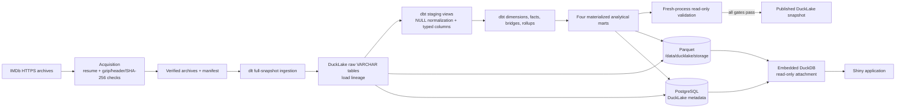

# Architecture

IMDb DuckLake is a local-first batch and query application. It converts the seven official IMDb
non-commercial snapshots into a validated DuckLake catalog without putting source data, generated
Parquet files, credentials, or machine-specific paths in Git. In the supported Compose runtime,
PostgreSQL is the authoritative DuckLake metadata catalog, Parquet is the durable analytical table
storage, and DuckDB is the embedded execution engine.

## End-to-end data flow

Acquisition verifies a complete immutable source set. Ingestion and transformation attach DuckLake
to one PostgreSQL metadata catalog and one bind-mounted Parquet root. Validation independently
reattaches the same catalog read-only from another Python process. The Shiny application uses the
same attachment contract. The shared runtime publishes snapshots directly and has no
`catalog.duckdb` or `current/` directory promotion step. See
[ADR 0010](adr/0010-postgresql-authoritative-ducklake-catalog.md).

The original file-catalog promotion workflow remains available only as an isolated local fallback
and fixture-test mechanism. Its metadata is not synchronized with PostgreSQL and is not the source
of truth for Docker or Shiny.

## Component boundaries

| Component | Owns | May depend on |
| --- | --- | --- |
| Shared policy | Dataset registry, settings, exception types, logging | Other shared policy only |
| `acquisition` | HTTP transfer, resume, archive verification, manifest | Dataset registry and exceptions |
| `lakehouse` | Paths, locks, space gates, cleanup, promotion, validation | Exceptions and its own lifecycle types |
| `ingestion` | dlt resources and DuckLake raw loading | Acquisition contracts, datasets, lakehouse paths |
| `transformation` | Explicit dbt process invocation | Lakehouse paths and exceptions |
| `query` | Read-only DuckLake attachment and mart queries | Settings, exceptions, and catalog target |
| `application` | Complete build use case and stage sequencing | Every inner component |
| `cli` | User-facing composition and stable exit codes | Application and stage entry points |

`tests/unit/test_architecture.py` enforces these dependency directions by parsing every package
module's internal imports. Inner components cannot import the application or CLI composition roots.
The architecture deliberately keeps SQL and data-quality policy in dbt instead of duplicating it in
Python.

## Storage and lineage

- `data/raw/` contains ignored `.tsv.gz` archives plus an atomic manifest with source metadata,
  byte sizes, checksums, and acquisition batch IDs.
- PostgreSQL database `ducklake_catalog`, schema `imdb_lake`, contains authoritative DuckLake
  metadata and snapshot state. Its Compose data is retained in the `postgres-data` named volume.
- `data/ducklake/storage/` contains the Parquet files referenced by the PostgreSQL catalog and is
  mounted at the identical `/data/ducklake/storage` path in every application container.
- `raw.ingestion_files` records the same source metadata in DuckLake. Raw dataset rows retain dlt's
  `_dlt_load_id`, linking each row back to its acquired file.
- Staging views preserve load lineage while converting IMDb's literal `\N` and text encodings into
  typed analytical values.
- Intermediate models define stable grains for titles, people, ratings, episodes, genres, credits,
  crew, and alternate titles.
- Marts materialize the query shapes consumed by the Shiny application.

The full interactive lineage graph, generated fresh from the current models, is published at
[tiagoadrianunes.github.io/imdb-ducklake](https://tiagoadrianunes.github.io/imdb-ducklake/).

## Failure and concurrency model

Only one mutating build may hold `data/ducklake/.build.lock`. The lock records enough information
to distinguish an active owner from a stale file. Each stage raises a typed domain exception, and
the CLI maps those types to documented stable exit codes. PostgreSQL must be healthy before a
one-shot pipeline container or the Shiny service starts. There is no external job queue or
persistent pipeline worker; dlt and dbt manage bounded internal parallelism.

The local file-catalog fallback retains its temporary-build cleanup, atomic `current/` promotion,
and retired-directory recovery semantics. Those mechanisms do not publish to PostgreSQL.

## Deployment boundary

This repository is the canonical source for code, tests, documentation, and synthetic fixtures.
It does not redistribute IMDb data or generated lakehouse artifacts. The Compose Shiny service is
local by default. Any public deployment requires a separate licensing review and must expose
analytical results without a raw-data download path.
