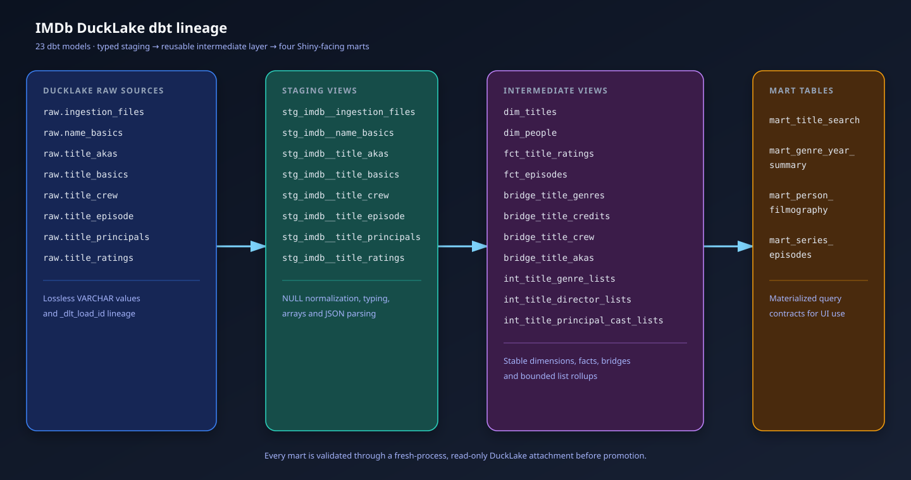

# Architecture

IMDb DuckLake is a single-user, local-first batch application. It converts the seven official IMDb
non-commercial snapshots into a validated DuckLake catalog without putting source data, generated
Parquet files, or machine-specific paths in Git.

## End-to-end data flow

```mermaid
flowchart LR
    imdb[IMDb HTTPS archives] --> acquire[Acquisition\nresume + gzip/header/SHA-256 checks]
    acquire --> manifest[Verified archives + manifest]
    manifest --> ingest[dlt full-snapshot ingestion]
    ingest --> raw[Isolated DuckLake\nraw VARCHAR tables + load lineage]
    raw --> staging[dbt staging views\nNULL normalization + typed columns]
    staging --> intermediate[dbt dimensions, facts, bridges, rollups]
    intermediate --> marts[Four materialized analytical marts]
    marts --> validate[Fresh-process read-only validation]
    validate -->|all gates pass| promote[Atomic current/ promotion]
    validate -->|any gate fails| discard[Delete temporary build\nleave current/ unchanged]
```

The application never edits the active build in place. Acquisition verifies a complete immutable
source set. Ingestion and transformation operate in a unique `data/ducklake/builds/<build-id>/`
workspace. Validation attaches that catalog read-only from another Python process. Promotion then
renames directories atomically, retaining the former current build for rollback.

## Component boundaries

| Component | Owns | May depend on |
| --- | --- | --- |
| Shared policy | Dataset registry, settings, exception types, logging | Other shared policy only |
| `acquisition` | HTTP transfer, resume, archive verification, manifest | Dataset registry and exceptions |
| `lakehouse` | Paths, locks, space gates, cleanup, promotion, validation | Exceptions and its own lifecycle types |
| `ingestion` | dlt resources and DuckLake raw loading | Acquisition contracts, datasets, lakehouse paths |
| `transformation` | Explicit dbt process invocation | Lakehouse paths and exceptions |
| `application` | Complete build use case and stage sequencing | Every inner component |
| `cli` | User-facing composition and stable exit codes | Application and stage entry points |

`tests/unit/test_architecture.py` enforces these dependency directions by parsing every package
module's internal imports. Inner components cannot import the application or CLI composition roots.
The architecture deliberately keeps SQL and data-quality policy in dbt instead of duplicating it in
Python.

## Storage and lineage

- `data/raw/` contains ignored `.tsv.gz` archives plus an atomic manifest with source metadata,
  byte sizes, checksums, and acquisition batch IDs.
- `raw.ingestion_files` records the same source metadata in DuckLake. Raw dataset rows retain dlt's
  `_dlt_load_id`, linking each row back to its acquired file.
- Staging views preserve load lineage while converting IMDb's literal `\N` and text encodings into
  typed analytical values.
- Intermediate models define stable grains for titles, people, ratings, episodes, genres, credits,
  crew, and alternate titles.
- Marts materialize the query shapes intended for the future Shiny application.

## Failure and concurrency model

Only one mutating build may hold `data/ducklake/.build.lock`. The lock records enough information
to distinguish an active owner from a stale file. Each stage raises a typed domain exception;
the CLI maps those types to documented stable exit codes. Temporary build cleanup is scoped to the
known build directory, and promotion uses a retirement directory plus recovery logic so an
interruption cannot silently destroy the last valid current build.

## Deployment boundary

This repository is the canonical source for code, tests, documentation, and synthetic fixtures.
It does not redistribute IMDb data or generated lakehouse artifacts. A future public application
requires a separate licensing review and must expose analytical results without a raw-data download
path.
